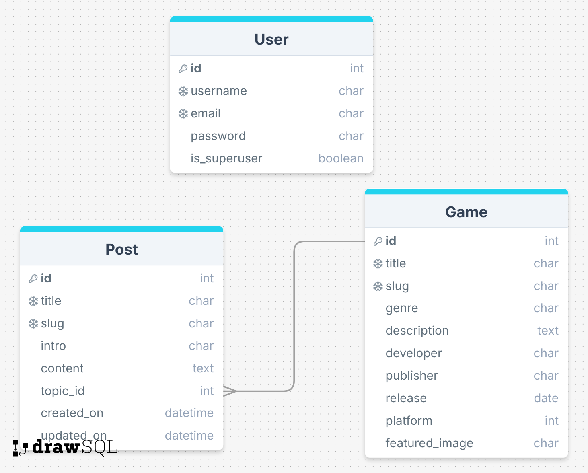

# Gamers Digest

Gamers Digest is a website that aims to keep gamers updated with the latest gaming news on different platforms. The site targets people of various ages that are gamers and gives you the opportunity to read news and find details and related news about each game. The website is updated with news regularly to keep users coming back to the site.

## Project goals:
- __User goals__
  - To keep updated with the latest news in the gaming industry
  - To explore content on a wide range of games, genres, and platforms
- __Site owner goals__
  - To showcase a fullstack web application that meets the assessment criteria
  - To create a service that provides a useful and informative content for gamers

## User experience

### User category
  - Gamers Digest is directed towards game enthusiasts

### User expectations
  - Collected gaming news from different sources 
  - Details about various games of multiple genres and platforms
  - A website with a smooth navigation and responsive design
  - An easy and secure registration and authentication process

### User stories

#### Epic 1: Account Management
- User Account Registration (MUST HAVE)
- Login to user account (MUST HAVE)
- Log out of User account (MUST HAVE)
- Show authentication status (SHOULD HAVE)
- Delete user account (SHOULD HAVE)
- Restore your password (COULD HAVE)
- Create a list of favourites (COULD HAVE)
- Full Control Over User Accounts (WON'T HAVE)

#### Epic 2: User Interaction
- Open a news post (MUST HAVE)
- Open a game post (MUST HAVE)
- Leave a comment on a post (COULD HAVE)
- Leave a review on a game (COULD HAVE)
- Manage content items (WON'T HAVE)

#### Epic 3: Site Management
- Manage news items (MUST HAVE)
- Manage game items (MUST HAVE)
- Receive confirmation messages (SHOULD HAVE)
- Receive validation messages (SHOULD HAVE)
- Categorize news posts (COULD HAVE)
- Categorize game posts (COULD HAVE)
- Track User Engagement and Analytics (WON'T HAVE)

#### Epic 4: User Experiences
- Make the interface visually Appealing (MUST HAVE)
- Have access to page about website (SHOULD HAVE)
- Paginate lists for easy navigation (SHOULD HAVE)
- Receive page load error Messages (SHOULD HAVE)

## Database
- __News application database schema__

When creating the database structure schema for this project, I utilized the [dbdiagram.io](https://dbdiagram.io/) website. This online tool allowed me to visually design and document the database schema, making it easier to plan and implement the database for the news application.

 

## Database Schema Summary

### `User` Table
- Represents the basic user information according to Django's built-in User model.
- Fields: `username`, `email`, `password`.

### `Platform` Table
- Stores the different platforms that the superuser can select when creating a game.
- Fields: `platform_id`, `platform_name`.

### `Post` Table
- Stores comments made by users on blog posts.
- Fields: `post_id`, `title`,`slug`, `intro`, `content`, `topic`, `created_on`, `updated_on`.

### `Game` Table
- Stores news posts written by the superuser.
- Fields: `game_id`, `title`, `slug`, `genre`, `description`, `platform`, `age_rating`, `developer`, `publisher`, `release`,  `featured_image`.

This database schema lays out the structure for the Gamers Digest application, giving an opportunity for gamers to easily keep updated with the latest gaming news and game details including releases.

## Design
### Color
- The header and the footer, both have a very dark blue background color pleasing to the eye and give a feeling of depth.

#### header
- Logo has a medium shade of cyan with hints of green. This color has a good contrast with the dark background and gives a feeling of tranquility. 
- Navigation links are white because they contrast well with the dark background and are comfortable for readers. 
- Links also have a soft blue hover effect to make them user-friendly.
- The authentication status message is dimmed which is inspired from the walkthrough project.
- Social media links has a cyan 

#### footer
- Text is in white to contrast well with the background color.
- Social media icons has a cyan color that contrasts well with the background color and make them stand out. 
- Icons have a hover effect with a soft blue color for user friendliness.

### Typography
  - Used "Lato" font family for the logo which is balanced and legible letterforms and has a friendly and approachable appearance.
  - Used sans serif font family for the rest of the website elements
  - Bolder fonts are used for page titles, post and game card titles and buttons 

### Layout
The Gamers Digest website is designed with a user-friendly structure, ensuring seamless navigation and easy access to the website's content, which is about gaming. Below is an overview of the website's structure:

  - **The header:**
    - The header is located at the top of the website.
    - It contains a logo "Gamers Digest" to the left.
    - A navigation bar comes after the logo with a list of options in text form.
    - An authentication message that shows the user login status to the right.

  - **The footer:**
    - The footer is at the bottom of the page.
    - It has a signature and social media links in icon form.

  - **Home Page:**
    - In the main page the user can view a list of news posts.
    - Each post is displayed as an engaging card, featuring an image, a clickable title, topic, and update date.

  - **News Post View:**
    - Each news post can be viewed in its entirety on a dedicated page.
    - This view is an engaging card that presents the title, topic, update date and an intro.
    - Two buttons 'Edit' and 'Delete', are only visible to superusers.
    - After that, detailed content about the news ends with an image.

  - **Create Post View:**
    - This page is a form for submitting posts.
    - The form has 5 fields title, slug, image, intro and content.
    - New posts, once published, are prominently displayed on the home page.
  
  - **Game List View:**
    - In the game list page the user can view a list of game posts.
    - Each game is displayed as an engaging card, featuring a clickable picture and game title.

  - **Create Game View:**
    - This page is a form for submitting games.
    - The form has nine fields title, slug, genre , description, platform, age rating, developer, publisher, release date and featured_image.
    - New games, once added, are prominently displayed on the game list page.
  - **Game details view:**
    - The game page shows details about each game and starts with the game title.
    - Two buttons 'Edit' and 'Delete', are only visible to superusers.
    - The content is a description and a picture with details: such as developer, publisher, platform, etc.
    - Below the news content, the user can see a list of posts related to the game.

### Wireframes

The wireframes serve as a visual blueprint for the application. Click on each page to view the wireframe.

Home page

About us

Register

Log in

Log out

Post list

Game list

Post details

Game details

Create New Post

Create New Game

Update Post

Update Game

## Features

### Existing Features
- Logo is the application's name and it takes you to the home page when clicking on it.
- A navigation bar with links to:
  - Home page
  - Games: it shows all games in a list
  - Create a post or a game
  - Register and log in if the user is logged out 
  - Just log out if the user is logged in.
- An informative message that tells if the user is logged in.
- About us section: It provides information about the website
- Read a news post
- Read game details
- Only administrators have access to the following functions:
  - Create a news post
  - Create a game 
  - Edit a news post
  - Edit a game 
  - Delete a news post
  - Delete a game
- View posts list on homepage
- Navigate to see more posts
- Filter posts by game genre
- Register an account
- Log in 
- Log out
- A footer that tells about the website's creator associated with clickable Social media links.
### Additional Features to Implement

## Testing

## Code Validation

### HTML Validation
I used the[W3C Markup Validation](https://validator.w3.org/) service to check the HTML code of my project for compliance with web standards. This tool is essential for identifying syntax errors and ensuring robust and standard-compliant HTML.

The HTML pages were extracted from dev tools using Google Chrome's inspect feature and then copy the HTML code for every page from sources. This code doesn't include Django Template Language to avoid validation errors (Some characters are not allowed) when using tools like W3C validator.

| **Tested** | **Result** | **View Result** | **Pass** |
--- | --- | --- | :---:
|login.html| No errors | 

Screenshot of result

| ✅
|logout.html| No errors | 

Screenshot of result

| ✅
|signup.html| No errors | 

Screenshot of result

| ✅
|about_us.html| No errors | 

Screenshot of result

| ✅
|index.html| No errors | 

Screenshot of result

| ✅
|game.html| No errors | 

Screenshot of result

| ✅
|post_detail.html| No errors | 

Screenshot of result

| ✅
|create_post.html| No errors | 

Screenshot of result

| ✅
|post.html| No errors | 

Screenshot of result

| ✅
|game_list.html| No errors | 

Screenshot of result

| ✅

### CSS Validation
[W3C Jigsaw](https://jigsaw.w3.org/css-validator/) is a tool provided by W3C that allows you to validate and check the correctness of your CSS code. It helps ensure that your web pages comply with the standards set by the W3C, promoting interoperability and accessibility.

| **Tested** | **Result** | **View Result** | **Pass** |
--- | --- | --- | :---:
|style.css| No errors |

Screenshot of result

| ✅

### Javascript Validation:
- No errors were found when passing javascript code through the official [Jshint validator](https://jshint.com/). The following metrics were returned:
  - point 1
  - point 2
  - point 3
  - point 4

### Python Validation:
[PEP 8](https://pep8ci.herokuapp.com/) serves as a comprehensive style guide for writing Python code, emphasizing consistency and readability as its core principles. It offers guidance on code formatting, variable and function naming conventions, and various best practices. Adhering to PEP 8 principles contributes to enhancing code quality, making it more readable and maintainable.

| **Tested** | **Result** | **View Result** | **Pass** |
--- | --- | --- | :---:
| gamers_digest/settings.py | All clear, no errors found | 

Screenshot of result

 | ✅ |
| gamers_digest/urls.py | All clear, no errors found | 

Screenshot of result

 | ✅ |
| news/models.py | All clear, no errors found | 

Screenshot of result

 | ✅ |
| news/views.py | All clear, no errors found | 

Screenshot of result

 | ✅ |
| news/forms.py | All clear, no errors found | 

Screenshot of result

 | ✅ |
| blog/urls.py | All clear, no errors found | 

Screenshot of result

 | ✅ |
| news/admin.py | All clear, no errors found | 

Screenshot of result

 | ✅ |
| news/tests/test_views.py | All clear, no errors found | 

Screenshot of result

 | ✅ |
| news/tests/test_models.py | All clear, no errors found | 

Screenshot of result

 | ✅ |
| news/tests/test_urls.py | All clear, no errors found | 

Screenshot of result

 | ✅ |
| news/tests/test_forms.py | All clear, no errors found | 

Screenshot of result

 | ✅ |

&nbsp;

## Manual Testing
&nbsp;
### Security Testing

Ensuring that users cannot access or modify content created by the superuser is crucial for maintaining the integrity and security of the application. The table demonstrates the application's robustness in handling unauthorized access attempts, ensuring user data security and integrity.

The following tests were conducted to verify that unauthorized access attempts are properly handled.

| Test Case | Description | Method | Expected Outcome | Actual Outcome | Result |
| --------- | ----------- | ------ | ---------------- | -------------- | --------- |
| Create Post Unauthorized Access | Non-admin attempting to create a post | Manual URL manipulation | The news-post creation form  is unavailable | A message tells this feature is only available to superusers | ✅ |
| Create Game Unauthorized Access | Non-admin attempting to create a game | Manual URL manipulation | The game-post creation form is unavailable | A message tells this feature is only available to superusers | ✅ |
| Edit Post Unauthorized Access | Non-admin attempting to edit a post | Manual URL manipulation | The adress non-functional | Redirect to post details page | ✅ | 
| Delete Post Unauthorized Access | Non-admin attempting to delete a post | Manual URL manipulation | The adress non-functional | Redirect to game list page | ✅ |
| Edit Game Unauthorized Access | Non-admin attempting to edit a game |  Manual URL manipulation | The adress non-functional | Redirect to game details page | ✅ |
| Delete Game Unauthorized Access | Non-admin attempting to delete a post | Manual URL manipulation | The adress non-functional | Redirect to game list page | ✅ |

### Testing user stories

**Epic 1: User Authentication & Profile Management**

| User Goals | How this was achieved | Screenshot |
| --- | --- | --- |
| [User Account Registration (MUST HAVE)](https://github.com/DebbieBergstrom/Culture-Club/issues/2) | Implemented a user registration system allowing visitors to create new accounts. Register option is in the navigation bar. | 

Screenshot of result

 |
| [Log Out of User Account (MUST HAVE)](https://github.com/DebbieBergstrom/Culture-Club/issues/3) | Provided logout functionality for user accounts. Log out option is in the navigation bar.| 

Screenshot of result

|
| [Log in to User Account (MUST HAVE)](https://github.com/DebbieBergstrom/Culture-Club/issues/3) | Provided login functionality for user accounts. Log in option is in the navigation bar.| 

Screenshot of result

|
| [Show authentication status (SHOULD HAVE)](https://github.com/DebbieBergstrom/Culture-Club/issues/3) | The user can see opposite the logo a confirmation message that tells the authentication status.| 

Screenshot of result

|
| [Full Control Over User Accounts (WON'T HAVE)](https://github.com/DebbieBergstrom/Culture-Club/issues/43) | This feature was not implemented in this phase, but admin can have full control in admin site. | No result image |
| | | |

&nbsp;
**Epic 2: User Interaction**

| User Goals | How this was achieved | Screenshot |
| --- | --- | --- |
| [Open a news post (MUST HAVE)](https://github.com/DebbieBergstrom/Culture-Club/issues/7) | Users can open news posts and read details. | 

Screenshot of result

 |
| [Open a game post (MUST HAVE)](https://github.com/DebbieBergstrom/Culture-Club/issues/8) | Users can open game posts and read details. | 

Screenshot of result

 |
| [ Manage content items (WON'T HAVE)](https://github.com/DebbieBergstrom/Culture-Club/issues/30) | Non-admin users can't manage data. | No result image |
|

&nbsp;

**Epic 3: Administration & Analytics**

| Site Owner Goals | How this was achieved | Screenshot |
| --- | --- | --- |
| [Manage news items (MUST HAVE)](https://github.com/DebbieBergstrom/Culture-Club/issues/13) | Admin can create, update and delete news items.| 

Screenshot of result

 |
| [Manage game items (SHOULD HAVE)](https://github.com/DebbieBergstrom/Culture-Club/issues/14) | Admin can create, update and delete game items. | 

Screenshot of result

 

Screenshot of result

 |
| [Receive confirmation messages (SHOULD HAVE)](https://github.com/DebbieBergstrom/Culture-Club/issues/15) | Admin gets a confirmation message when: login, logout, create, edit and delete content items. | 

Screenshot of result

 |
| [ Receive error messages (SHOULD HAVE) ](https://github.com/DebbieBergstrom/Culture-Club/issues/15) | Admin gets an error message when item creation, update, and deletion fails. | 

Screenshot of result

 |
| [ Track User Engagement and Analytics (WON'T HAVE)](https://github.com/DebbieBergstrom/Culture-Club/issues/16) | This feature for tracking analytics was not implemented in the current phase. | No result image |
| | | |

&nbsp;

**Epic 4: User Experience & Accessibility**

- Make the interface visually Appealing (MUST HAVE)
- Have access to page about website (SHOULD HAVE)
- Paginate lists for easy navigation (SHOULD HAVE)
- Receive page load error Messages (SHOULD HAVE)

| User Goals | How to achieve this | Screenshot |
| --- | --- | --- |
| [ Interact visually Appealing interface (MUST HAVE)](https://github.com/DebbieBergstrom/Culture-Club/issues/17) | Design the interface in a well structured manner, Make it responsive and accessible. | 

Screenshot of result

 |
| [ access page about the website (SHOULD HAVE)](https://github.com/DebbieBergstrom/Culture-Club/issues/18) | Included clear navigation to the 'About Us' section to inform users about the website. Can always be seen in the navbar or the collapsed menu in smaller screens. | 

Screenshot of result

 |
| [ Browse lists (SHOULD HAVE)](https://github.com/DebbieBergstrom/Culture-Club/issues/32) | Implemented pagination for easy browsing of news and game posts. | 

Screenshot of result

 

Screenshot of result

 |
| [Receive page load error Messages (SHOULD HAVE)](https://github.com/DebbieBergstrom/Culture-Club/issues/42) | User gets an error page if something isn't working correctly. | 

Screenshot of result

 |
| | | |

### Element Testing:

#### Navbar:

- **`Not logged in user`**

| Feature | Expected Function | Testing Performed | Result | Pass/Fail |
| --- | --- | --- | --- | --- |
| Logo | Redirects to home page | Clicked on logo | Home page loads | ✅ |
| Posts | Redirects to the post list page | Clicked on the link 'Games' | 'post list' page loads | ✅ |
| Games | Redirects to the game list page | Clicked on the link 'Games' | 'game list' page loads | ✅ |
| About Us | Redirects to the 'About Us' page | Clicked on the link 'About Us' | 'About Us' page loads | ✅ |
| Register | Redirects to the sign up page which contains a form with a 'Sign Up' button | Clicked on the link 'Register' | The Sign-up page loads and the form displays with a 'Sign Up' button | ✅ |
| Login | Redirects to the login page which contains a form with a 'Sign In' button | Clicked on the link 'Login' | The Sign-in page loads and the form displays with a 'Sign Up' button | ✅ |
| | |

&nbsp;

- **`Logged in as user`**

| Feature | Expected Outcome | Testing Performed | Result | Pass/Fail |
| --- | --- | --- | --- | --- |
| Logo | Redirects to home page | Clicked on logo | Index page loads | ✅ |
| "Create" menu (only administrator) | Triggers the dropdown menu | Clicked on "create" link | The dropdown menu is displayed | ✅ |
| About Us | Redirects to the 'About Us' page. | Clicked on the link 'About Us' | 'About Us' page loads. | ✅ |
| Posts | Redirects to the post list page | Clicked on the link 'Games' | 'post list' page loads | ✅ |
| Games | Redirects to the game list page | Clicked on the link 'Games' | 'game list' page loads | ✅ |
| Logout | Redirects to the logout page. | Clicked on the 'Logout' link | The logout page loads and the form displays with a confirmative question and a sign out button. | ✅ |
|

&nbsp;

- **`Create drop-down menu, logged in as administrator`**

| Feature | Expected Outcome | Testing Performed | Result | Pass/Fail |
| --- | --- | --- | --- | --- |
| "New Post" link (only administrator) | Redirects to the 'Create Post' page with the 'Create Post' button visible | Clicked on the link 'Create new Post' | 'Create new Post' page loads and shows the 'Create Post' button | ✅ |
| "New Game" link (only administrator) | Redirects to the 'Create new Post' page with the 'Create Post' button visible | Clicked on the link 'Create new Post' | 'Create new Post' page loads and shows the 'Create Post' button | ✅ |
| | |

&nbsp;

#### Sign up page:

- **`Not logged in user`**

| Feature | Expected Outcome | Testing Performed | Result | Pass/Fail |
| --- | --- | --- | --- | --- |
| Username input | Field is required and should be a valid username format | Tested with an empty field, invalid format | Error message is displayed prompting the user to provide a valid username | ✅ |
| Email input | Field is optional but should be a valid email format if entered | Tested with an empty field and invalid format | Sign up can be successful without email address. Error message displayed prompting the user to provide a valid email address if user type in the field | ✅ |
| Password input | Field is required and should meet password criteria | Tested with an empty field, invalid criteria | Error message displayed prompting the user to provide a valid password | ✅ |
| Password confirmation input | Field is required and should match the entered password | Tested with empty field, mismatched passwords | Error message displayed prompting the user to confirm the password correctly | ✅ |
| "Sign up" button | If the form is valid, the user is redirected to the home page with a message confirming successful registration. If the form is not valid, an error message is displayed. | Clicked the button with valid and non-valid formats | The button functions as expected, redirecting to the appropriate page and displaying the corresponding messages | ✅ |
| "Sign in" text link | Redirects to the login page | Clicked on the "Sign in" link | The login page and form were successfully loaded | ✅ |
| | |

&nbsp;

#### Home page:

| Feature | Expected Outcome | Testing Performed | Result | Pass/Fail |
| --- | --- | --- | --- | --- |
|  |  |  |  |  |
|  |  |  |  |  |
|  |  |  |  |  |
|  |  |  |  |  |
|  |  |  |  |  |
|  |  |  |  |  |
| | |

&nbsp;

#### Item lists:

- **`Post list page`**

| Feature | Expected Outcome | Testing Performed | Result | Pass/Fail |
| --- | --- | --- | --- | --- |
| Post card title link | Redirects to the post details page | Clicked on the title link of a post | Successfully redirected to the post details page | ✅ |
| Pagination | Displays pagination if the page has more than 6 posts | Added more than 6 posts to the list | Pagination is displayed.| ✅ |
| 'Next' and 'Previous' buttons for switching pages | Navigates to the correct page | Clicked on Next and Previous buttons in pagination. | Successfully navigated to the correct page based on the button clicked | ✅ |
| | |

&nbsp;

- **`Game list page`**

| Feature | Expected Outcome | Testing Performed | Result | Pass/Fail |
| --- | --- | --- | --- | --- |
| Game card image link | Redirects to the game details page | Clicked on the image link of a game card | Successfully redirected to the game details page | ✅ |
| Pagination | Displays pagination if the page has more than 6 games | Added more than 6 games to the list | Pagination is displayed.| ✅ |
| 'Next' and 'Previous' buttons for switching pages | Navigates to the correct page | Clicked on Next and Previous buttons in pagination. | Successfully navigated to the correct page based on the button clicked | ✅ |
| | |

&nbsp;

#### Post details:

- **`Not logged in, Logged in as user`**

| Feature | Expected Outcome | Testing Performed | Result | Pass/Fail |
| --- | --- | --- | --- | --- |
| News post topic link | Redirects to game details page | Clicked on post topic link | Successfully redirected to the game details page. | ✅ |
| News post source link | Redirects you to the external source of the news post. | Clicked on the source link | Successfully redirected to the external source page  | ✅ |
| | |

&nbsp;

- **`Logged in as administrator`**

| Feature | Expected Outcome | Testing Performed | Result | Pass/Fail |
| --- | --- | --- | --- | --- |
| News post topic link | Redirects to game details page | Clicked on post topic link | Successfully redirected to the game details page. | ✅ |
| News post source link | Redirects you to the external source of the news post. | Clicked on the source link | Successfully redirected to the external source page  | ✅ |
| 'Edit' button | Changes made to the post will be saved | Clicked the 'Edit' button | The page scrolls down and displays a form to edit | ✅ |
| 'Delete' button  | Deletes a post | Clicked on the 'Delete' button | A modal popup shows to ask user confirmation for deletion. | ✅ |
| | |

#### Game details:

- **`Not logged in, Logged in as user`**

| Feature | Expected Outcome | Testing Performed | Result | Pass/Fail |
| --- | --- | --- | --- | --- |
| related posts links to the game | Redirects to the specific post details page | Clicked on the post title link | Successfully redirected to the post details page. | ✅ |
| | |

&nbsp;

- **`Logged in as administrator`**

| Feature | Expected Outcome | Testing Performed | Result | Pass/Fail |
| --- | --- | --- | --- | --- |
| related posts links to the game | Redirects to the specific post details page | Clicked on the post title link | Successfully redirected to the post details page. | ✅ |
| 'Edit' button | Changes made to the game post will be saved | Clicked the 'Edit' button | The page scrolls down and displays a form to edit | ✅ |
| 'Delete' button  | Deletes a game post | Clicked on the 'Delete' button | A modal popup shows to ask user confirmation for deletion. | ✅ |
| | |

&nbsp;

#### Create Items:

- **`Create New Post page`**

| Feature | Expected Outcome | Testing Performed | Result | Pass/Fail |
| --- | --- | --- | --- | --- |
| "Create" button | Upon filling in the required fields and clicking "Create Post", the new news post should be saved and the user should be redirected to the post list page | Filled in required fields and clicked on the "Create Post" button | Successfully created a new post, redirected to the blog post detail page, and displayed the newly created post | ✅ |
| Title input field (required) | Must enter a title to create a post | Entered a title for the blog post | Successfully required and accepted the title input | ✅ |
| Content input field (required) | Must enter content to create a post | Entered content for the news post | Successfully required and accepted the content input | ✅ |
| Intro input field (Optional) | Allows entering an intro to create a post | Entered intro for the news post | Successfully accepted the intro input | ✅ |
| Image upload (Not implemented) | Allows uploading an image for the news post, uses a placeholder if no image is uploaded | Uploaded an image for the news post | Successfully displayed the uploaded image (or placeholder if none) |  |
| Topic selection (required) | Requires selecting a topic from the list | Selected a topic for the news post | Successfully required and accepted the selection of a topic | ✅ |
| | |

&nbsp;

- **`Create New Game page`**

| Feature | Expected Outcome | Testing Performed | Result | Pass/Fail |
| --- | --- | --- | --- | --- |
| "Create" button | Upon filling in the required fields and clicking "Create Game", the new game post should be saved and the user should be redirected to the game details page | Filled in required fields and clicked on the "Create" button | Successfully created a new game, redirected to the game listpage, and displayed the newly created post | ✅ |
| Title input field (required) | Must enter a title to create a game | Entered a title for the game post | Successfully required and accepted the title input | ✅ |
| Genre input field | Must enter a genre to create a game | Entered an excerpt for the blog post | Successfully required and accepted the genre input | ✅ |
| Description input field (required) | Must enter a description to create a game | Entered a description for the game post | Successfully required and accepted the title input | ✅ |
| Platform selection (required) | Requires selecting a platform from the list | Selected a platform for the game post | Successfully required and accepted the selection of a platform | ✅ |
| Age rating input field (required) | Must enter an age rating to create a post | Entered an age rating for the game post | Successfully accepted the age rating input | ✅ |
| Developer input field (required) | Must enter a developer name to create a game post | Entered a developer name for the game post | Successfully accepted the developer name input | ✅ |
| Publisher input (required) | Validates input and requires a publisher name for the game. | Entered a publisher for the game. | Successfully validated and accepted the publisher input | ✅ |
| Date of Release input (required) | Validates input and requires a date of release for the game. | Entered a date of release for the game. | Successfully validated and accepted the date of release input | ✅ |
| Image upload (Required) | Must upload an image to create a game post, uses a placeholder if no image is uploaded | Uploaded an image for the game post | Successfully displayed the uploaded image (or placeholder if none) | ✅ |
| | |

&nbsp;

#### Edit Items: 

- **`Update post button, logged in as administrator`**

| Feature | Expected Outcome | Testing Performed | Result | Pass/Fail |
| --- | --- | --- | --- | --- |
| "Update" button | When changes are made and the "Update" button is clicked, the changes should be saved, the user should be redirected to the news post details page with a confirmation success message "The post is updated". | Made changes and clicked on the "Update" button. | Changes were successfully saved, redirected to the news post detail page with a confirmation success message "The post is updated". | ✅ |
| | |

&nbsp;

- **`Update game button, authorized/logged in as administrator`**

| Feature | Expected Outcome | Testing Performed | Result | Pass/Fail |
| --- | --- | --- | --- | --- |
| "Update" button | When changes are made and the "Update" button is clicked, the changes should be saved, the user should be redirected to the game detail page with a confirmation success message "The game is updated". | Made changes and click on the "Update" button | Changes were successfully saved, redirected to the game details page with a confirmation success message "The game is updated".  | ✅ |
| | |

&nbsp;

#### Delete Items:

- **`Delete post button, authorized/ logged in as administrator`**

| Feature | Expected Outcome | Testing Performed | Result | Pass/Fail |
| --- | --- | --- | --- | --- |
| "Yes, Delete" button | When the "Yes, Delete" button is clicked, the post is deleted, and the user is redirected to the "My Posts" page with a confirmation success message "The post is deleted". | Clicked on the "Delete" button | Successfully deleted the post, redirected to the "My Posts" page, and displayed a confirmation success message | ✅ |
| "Close" button | Redirects to the post details page | Clicked on the "Close" button | Successfully redirected to the post details page. | ✅ |
| | |

&nbsp;

- **`Delete game button, authorized/ logged in as administrator`**

| Feature | Expected Outcome | Testing Performed | Result | Pass/Fail |
| --- | --- | --- | --- | --- |
| "Yes, Delete" button | When the "Yes, Delete" button is clicked, the game is deleted, and the user is redirected to the game list page with a confirmation success message "The game is deleted" | Clicked on the "Delete" button | Successfully deleted the game, redirected to the game list page, and displayed a confirmation success message | ✅ |
| "Close" button | Redirects to the game details page | Clicked on the "Close" button | Successfully redirected to the game details page. | ✅ |
| | |

&nbsp;

#### Footer

- **`all pages`**

| Feature | Expected Outcome | Testing Performed | Result | Pass/Fail |
| --- | --- | --- | --- | --- |
| Facebook link | Redirects to Facebook official website | Clicked on the Facebook icon/link | Successfully redirected to Facebook official website | ✅ |
| X link | Redirects to X official website | Clicked on the X icon/link | Successfully redirected to X official website | ✅ |
| Instagram link | Redirects to Instagram official website | Clicked on the Instagram icon/link | Successfully redirected to Instagram official website | ✅ |
| Youtube link | Redirects to Youtube official website | Clicked on the Youtube icon/link | Successfully redirected to Youtube official website | ✅ |
| | |

&nbsp;

### Responsivness:
Tested the website responsiveness for different device types using [responsive design checker](https://responsivedesignchecker.com/) tool. The result was that heroku server doesn't allow access for this tool. Tested also with [Am I Responsive](https://ui.dev/amiresponsive) and [Responsive test tool](https://responsivetesttool.com/) and they showed the same result as in the first test.

### Bugs
#### Solved bugs
#### Unfixed bugs

## Deployment

**Create the Heroku app:**

- Navigate to your Heroku dashboard and create a new app with a unique name.
- Click on the Settings tab and reveal the config vars.
- Add a key of DISABLE_COLLECTSTATIC and a value of 1 and click Add.
- This step prevents Heroku from uploading static files, such as CSS and JS, during the build.
---
**Update your code for deployment:**

- Install a production-ready webserver for Heroku using the command <mark>pip3 install gunicorn~=20.1</mark>
- Add gunicorn==20.1.0 to the requirements.txt file with: <mark>pip3 freeze --local > requirements.txt</mark>
- Create a file named Procfile at the root directory of the project (same directory as requirements.txt).
- In the Procfile, declare this is a web process followed by the command to execute your Django project and start the server.
  <mark>web: gunicorn my_project.wsgi</mark> This assumes your project is named my_project.
- Open the my_project/settings.py file and replace DEBUG=True with DEBUG=False. and append the '.herokuapp.com' hostname to the ALLOWED_HOSTS list.
- Git add, commit and push the code to your GitHub repo.
---
**Connect Heroku to PostgreSQL database:**
- Navigate to heroku dashbord and return to settings.
- Click on <mark>Reveal Config Vars</mark> and add <mark>DATABASE_URL</mark>.
- Note! if ElephantSQL is used as a PostgreSQL provider. 
- Navigate to https://www.elephantsql.com/, log in and create a database instance.
- Open your created instance and go to the details tag.
- copy the provided PostgreSQL <mark>URL</mark>.
- Assign it as a value to DATABASE_URL in the Heroku dashboard.
- Now your PostgreSQL cloud database is connected to your deployed app.
---
**Deploy to Heroku:**
- Add the environment variable <mark>SECRET KEY</mark> to the Heroku app's config vars in the settings for security reasons.
- Now, let's return to the Heroku dashboard, and in your app, click on the Deploy tab.
- In the Deployment method section enable GitHub integration by clicking on Connect to GitHub.
- Search for your GitHub repo and connect it to the Heroku app.
- Scroll down and Manually deploy the main branch of this GitHub repo.
- In your new app’s resources tab, ensure you are using an eco dyno and delete any Postgres database Add-on.
- Click on <mark>Open app</mark> to open the rendered webpage.
---
### Fork the Repository:
By forking the GitHub Repository, you can create a copy of the original repository without affecting the original. To implement that follow these steps below:

- Log into GitHub account or create one if you don't have one.
- Locate the Repository. Note! the repository is at https://github.com/programmer-1991/gamers-digest.
- At the top right of the repository page, click "Fork" to create a copy in your own GitHub repository.

**Clone the Repository:**
When you create a repository on GitHub.com, it exists as a remote repository. You can clone your repository to create a local copy on your computer and sync between the two locations. Creating a clone allows you to have a local copy of the project. Follow these steps:

- Navigate to https://github.com/programmer-1991/gamers-digest.
- Click the green "Code" button at the top right.
- Select the "Clone by HTTPS" option and copy the web URL to the clipboard.
- Open your code editor or terminal and navigate to the directory where you want to clone the repository.
- Run `git clone` followed by the copied URL.
- Press enter, and Git will clone the repository to your local machine.

# Credits
### Here's a collection of sites that were helpful in creating this website:

- [Django documentation](https://getbootstrap.com/docs/4.1/getting-started/introduction/) is used for guidance with models, forms, templates, and various aspects of Django development.

- [Bootstrap documentation](https://getbootstrap.com/docs/4.1/getting-started/introduction/) is used to increase knowledge of Bootstrap framework.

- [W3 Schools](https://www.w3schools.com/)

- [Stackoverflow](https://stackoverflow.com/) was used for:
  - Scroll down the page upon clicking the Edit button.

- Tutorials and YouTube videos:
  - [Portfolio Project 4: The guide to MVP](https://www.youtube.com/watch?v=vIv1c6RLBac)
  - [Assessments Q&A: Focus on PP4](https://www.youtube.com/watch?v=_0VXXEgchw4)
  - [The guide to the Github Agile Tool](https://www.youtube.com/watch?v=U_dMihBgUNY)

- Other sites:
  - [Styling Crispy forms](https://blog.appseed.us/django-forms-styling-with-bootstrap/)
  - [Organize Imports](https://peps.python.org/pep-0008/)
  - [Generate Slugs](https://www.kodnito.com/posts/slugify-urls-django/)
  - [How to override default django templates](https://www.makeuseof.com/override-default-templates-django-allauth/)
  - [Automated testing tutorial](https://www.youtube.com/watch?v=6I_haJimhPY)

- The base structure of the project is inspired by the walkthrough project `I think therefore I blog`.
- Readme structure is based on [readme template](https://github.com/DebbieBergstrom/Culture-Club/blob/main/README.md) belonging to `Culture Club project` created by [DebbieBergstrom](https://github.com/DebbieBergstrom).
- The favicon used in the application was taken from [favicon io](https://favicon.io/).
- The fonts used in the application was taken from [Google Fonts](https://fonts.google.com/).

- [Favicon Generator](https://favicon.io/) to create a favicon in the browser tab.
- [Pexels Free Images](https://www.pexels.com/sv-se/) to find some user profile mockup images.
- [Freepik Free Images](https://www.freepik.com/free-photos-vectors/user-profile) to find user profile symbols and default images.
